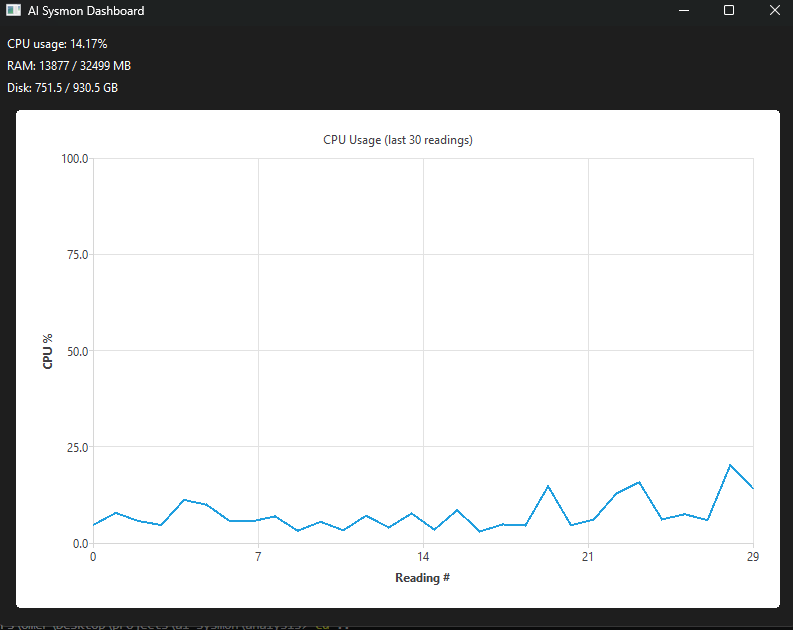
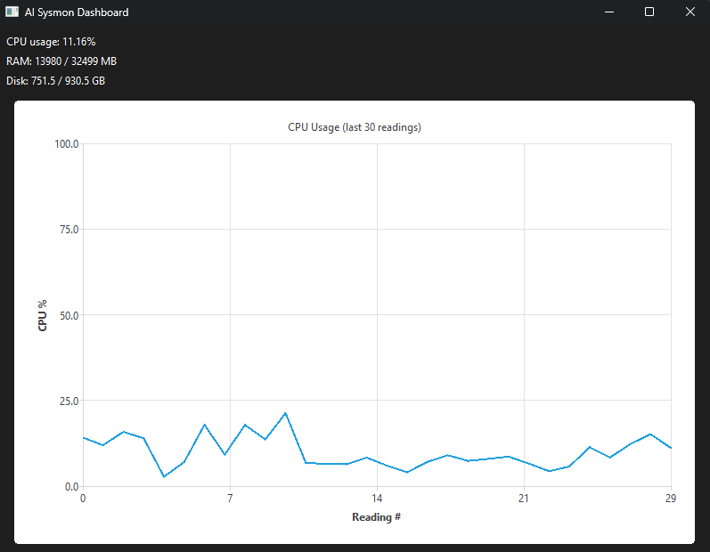

# AI Sysmon — AI-Powered System Monitoring Platform

A lightweight system monitoring and analysis platform for Windows, inspired by tools like Prometheus, Zabbix, and Datadog. Built as a learning project to understand the full stack of a real monitoring system: low-level OS metric collection, a relational database backend, statistical anomaly detection, and a live desktop dashboard.

## Architecture

```
+-------------+      +--------------+      +-------------------+
|   C Agent   | ---> |  PostgreSQL  | <--- |  Python Analysis   |
| (Windows API)|      |  (storage)   |      | (pandas, z-score)  |
+-------------+      +--------------+      +-------------------+
                                                      |
                                                      v
                                             +-------------------+
                                             |  PySide6 Desktop  |
                                             |     Dashboard      |
                                             +-------------------+
```

- **C Agent** - collects CPU, RAM, disk, network, and process metrics directly from the Windows API (no external libraries for metrics) and writes them to PostgreSQL every second.
- **PostgreSQL** - central data store; decouples collection from analysis, so either side can run independently or be restarted without affecting the other.
- **Python Analysis Layer** - reads metrics with `pandas`, computes statistics, detects anomalies via z-score, predicts short-term trends via linear regression, and writes alerts back to the database.
- **PySide6 Desktop App** - a live dashboard showing current CPU/RAM/disk usage and a real-time CPU history chart, refreshing on a configurable interval.

## Screenshots






## Features

- Real-time collection of CPU, RAM, disk, network, and per-process metrics on Windows
- PostgreSQL-backed storage with a normalized schema (`machines`, `system_metrics`, `processes`, `alerts`)
- Statistical anomaly detection (z-score based) with severity tiers (warning / critical)
- Trend prediction using linear regression (`numpy.polyfit`)
- Alert persistence to the database for later review
- Live desktop dashboard (PySide6 + QtCharts) with configurable refresh interval
- Centralized JSON configuration (no hardcoded thresholds/intervals)
- Automated unit tests (`pytest`) for core analysis logic

## Tech Stack

| Layer | Technology |
|---|---|
| Metric Collection | C, Windows API (`GetSystemTimes`, `GlobalMemoryStatusEx`, `GetDiskFreeSpaceEx`, ToolHelp32, IP Helper API) |
| Database | PostgreSQL |
| DB Client (C) | libpq |
| Analysis | Python, pandas, numpy, psycopg2 |
| Desktop UI | PySide6 (Qt for Python), QtCharts |
| Testing | pytest |

## Project Structure

```
ai-sysmon/
├── agent/              # C monitoring agent (CMake project)
│   ├── include/         # headers (cpu, ram, disk, process, network, db)
│   └── src/             # implementations + main collection loop
├── db/
│   └── schema.sql        # database schema (source of truth for tables)
├── analysis/            # Python analysis layer
│   ├── src/
│   │   ├── db/           # connection.py - shared DB access layer
│   │   ├── insights/     # anomaly.py, prediction.py, stats.py
│   │   └── config.py     # loads config.json
│   └── tests/            # pytest unit tests
├── desktop_app/         # PySide6 live dashboard
│   └── src/main.py
├── config.json          # shared runtime configuration
└── PROJECT_CHARTER.md   # original project planning document
```

## Setup

### Prerequisites
- Windows 11
- PostgreSQL (tested on v18)
- CMake + MSVC build tools
- Python 3.14+

### 1. Database
```powershell
# initialize and start PostgreSQL manually (no admin service registered)
& "C:\Program Files\PostgreSQL\18\bin\pg_ctl.exe" -D "<your-data-dir>" -l logfile.txt start

# create the database and load the schema
psql -U postgres -c "CREATE DATABASE ai_sysmon;"
psql -U postgres -d ai_sysmon -f db/schema.sql
```

### 2. C Agent
```powershell
cd agent
cmake -B build
cmake --build build
.\build\Debug\sysmon_agent.exe
```
> Requires `libpq.dll`, `libintl-9.dll`, `libssl-3-x64.dll`, `libcrypto-3-x64.dll` alongside the executable (copied automatically by the CMake build step).

### 3. Python Analysis
```powershell
cd analysis
python -m venv .venv
.venv\Scripts\Activate.ps1
pip install -r requirements.txt

python src/insights/anomaly.py
python src/insights/prediction.py
```

### 4. Desktop Dashboard
```powershell
cd desktop_app
python -m venv .venv
.venv\Scripts\Activate.ps1
pip install -r requirements.txt

python src/main.py
```

### Configuration
Edit `config.json` at the project root to adjust behavior without touching code:
```json
{
  "refresh_interval_ms": 3000,
  "chart_history_size": 30,
  "anomaly_z_threshold": 3,
  "machine_id": 1
}
```

## Testing
```powershell
cd analysis
pytest tests/
```
## Known Limitations

- Single-machine monitoring only (`machine_id` is hardcoded/config-based, no multi-host UI yet)
- PostgreSQL credentials are hardcoded for simplicity - not suitable for production as-is
- PostgreSQL must be started manually each session (no Windows service registered)
- Anomaly detection uses a simple z-score model - no seasonality or multivariate detection
- Windows-only metric collection (architecture is designed so a Linux agent could be added later by replacing only the collection module)

## Roadmap / Possible Extensions
- Linux monitoring agent (replacing only the collection module)
- Web dashboard (Flask/FastAPI)
- Multi-machine fleet view
- More advanced anomaly detection (e.g. moving-window models, seasonality-aware baselines)

## License
MIT
